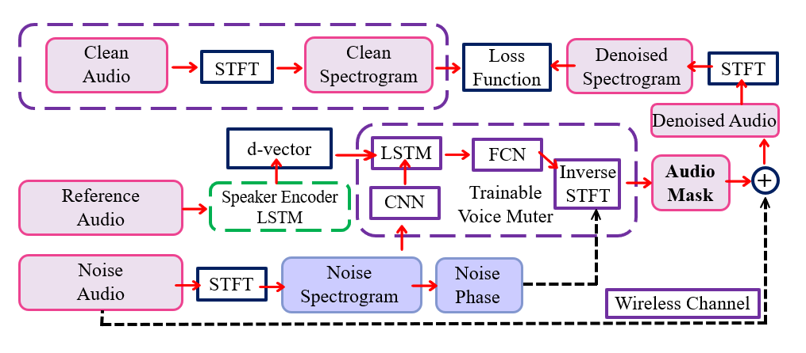

# Infocom2021
Flowchartof the AI network.



## Deployment Guidance (python 3 preferred)

### Google API + [WER/MER/WIL Metric](https://pypi.org/project/jiwer/)

pip install SpeechRecognition google-cloud-speech google-api-python-client oauth2client jiwer

Test: cd utils && python speech2text.py

### [SDR/SIR/SAR Metric](https://craffel.github.io/mir_eval/#mir_eval.separation.bss_eval_sources)

sdr,sir,sar = mir_eval.separation.bss_eval_sources(reference_sources, estimated_sources, compute_permutation=True)

### Benchmark

#### focus my voice:

```bash
python metric_eva_focus.py -c config/focusTest.yaml -e model/embedder.pt --checkpoint_path ../trained_model/enhance_my_voice/chkpt_201000.pt -o eva-focus -m focus -g 0 -x [noise]-[XdB].xlsx
```

#### hide my voice:

```bash
python metric_eva_hide.py -c config/hideTest.yaml -e model/embedder.pt --checkpoint_path ../trained_model/hide_my_voice/chkpt_304000.pt -o eva-hide -m hide -g 0 -x [noise]-[XdB].xlsx
```

## Version Control

| Version | Description |
| ------ | ------ |
| V0  | Original Version of voicefilter |
| V1.0  | ~~after * mask, the purified_mag -> istft -> purified_wav -><br> + mixed_wav -> denoised_wav -> stft -> denoised_mag -> loss~~ |
| V2.0  | ~~put istft into model. model_output -> istft -> audio_mask -><br> + mixed_wav -> denoised_wav -> stft -> denoised_mag -> loss~~|
| V2.1  | ~~change normalize function in stft~~ |
| V3.0  | ~~Use linearity of Fourier Transform, only change * to - operation from V0~~ |
| V3.1  | Apply normalization after mixed_mag - noise_mag |
| V3.1.1  | ~~Add 3 different evaluations for wavs based on v3.1~~|
| V3.1.2  | Change dataloader, get new_target_wav = mixed_wav - target_wav|
| V3.2  | ~~Use + operation instead of - compare with v3.1~~|
| V3.2.1  | Add 3 different evaluations for wavs based on v3.2|
| V3.2.2  | ~~Add generator2, new dataloader based on v3.2.1~~|
| V3.2.3  | Use plus to train hide my voice, add dataloader option for old and new dataset|

## Dataset path in server

| Dataset | PATH |
|--------|-------|
| train-100|
|audios after normalize.sh| /srv/node/sdc1/LibriSpeech|
|spectrograms after generator.py| ~~/srv/node/sdd1/small-processed-audio~~|
| train-360|
|audios after normalize.sh| /srv/node/sdc1/medium-LibriSpeech|
|spectrograms and phases after v2 generator.py| /srv/node/sdc1/medium-processed-audio|
|New dataset|
|New dataset based on train-360|/srv/node/sdd1/new-processed-audio|

## Schedule

| Period | chenning | hanqing |
| ------ | ------ | ------ |
| 0701-0703 | Power loss[x]| Reproduction [x]|
| 0704-0704 |       |Code Review [x], dataset Production [x]|
| 0705-0708 | Paper introduction draft & pipeline optimization   [x]   |code v3 [x]|
| 0709-0711 | System design     |Preliminary on public dataset|
| 0713-0718 | Finish experimental evaluation     |Finish experimental evaluation|
| 0720-0725 | Finish user case 1     |Finish user case 1|
| 0727-0801 | Finish user case 2     |Finish user case 2|
| 0803-0808 | Paper v1     |Paper v1|
| 0809-0814 | Paper submission     |Paper submission|
# VoiceFilter

Unofficial PyTorch implementation of Google AI's:
[VoiceFilter: Targeted Voice Separation by Speaker-Conditioned Spectrogram Masking](https://arxiv.org/abs/1810.04826).


## Dependencies

1. Python and packages

    ```bash
    pip install -r requirements.txt
    ```

## Prepare Dataset

1. Download LibriSpeech dataset

    To replicate VoiceFilter paper, get LibriSpeech dataset at http://www.openslr.org/12/.
    `train-clear-100.tar.gz`(6.3G) contains speech of 252 speakers, and `train-clear-360.tar.gz`(23G) contains 922 speakers.
    You may use either, but the more speakers you have in dataset, the more better VoiceFilter will be.

1. Resample & Normalize wav files

    First, unzip `tar.gz` file to desired folder:
    ```bash
    tar -xvzf train-clear-360.tar.gz
    ```

    Next, copy `utils/normalize-resample.sh` to root directory of unzipped data folder. Then:
    ```bash
    vim normalize-resample.sh # set "N" as your CPU core number.
    chmod a+x normalize-resample.sh
    ./normalize-resample.sh # this may take long
    ```

1. Edit `config.yaml`

    ```bash
    cd config
    cp default.yaml config.yaml
    vim config.yaml
    ```
#### Tips:

change `train_dir` and `test_dir`. Maintain different `config.yaml` at desktop and server.

1. Preprocess wav files

    In order to boost training speed, perform STFT for each files before training by:
    ```bash
    python generator.py -c [config yaml] -d [data directory] -o [output directory] -p [processes to run]
    ```
    This will create 100,000(train) + 1000(test) data. (About 160G)

#### Tips:

1. Run `v0 => generator.py` can get `mixed_mag`, `mixed_wav`, `target_mag`, `target_wav`, `d_vector.txt`. Note this `d_vector.txt` is the path of reference audio.

2. Run `v1.0` or `v2.0` `generator.py` can also get `mixed_phase` and `target_phase`.

3. On server side, DO NOT use -p as multi-processor.

## Train VoiceFilter

1. Run

    After specifying `train_dir`, `test_dir` at `config.yaml`, run:
    ```bash
    python trainer.py -c [config yaml] -e [path of embedder pt file] -g 1 -l power/mse -m [name]
    ```
    This will create `chkpt/name` and `logs/name` at base directory(`-b` option, `.` in default)

#### Tips:

1. add `-g` to choose cuda device, default is device 1. This arg is required.

2. add `-l` to select loss type, default is power loss. Can switch to mse loss by specifying this arg to mse.


1. View tensorboardX

    ```bash
    tensorboard --logdir ./logs
    ```

1. Resuming from checkpoint

    ```bash
    python trainer.py -c [config yaml] --checkpoint_path [chkpt/name/chkpt_{step}.pt] -e [path of embedder pt file] -g 1 -l power/mse -m name
    ```

## Evaluate

```bash
python inference.py -c [config yaml] -e [path of embedder pt file] --checkpoint_path [path of chkpt pt file] -m [path of mixed wav file] -r [path of reference wav file] -g 1 -o [output directory]
```

## Possible improvments

- Try power-law compressed reconstruction error as loss function, instead of MSE. (See [#14](https://github.com/mindslab-ai/voicefilter/issues/14))
